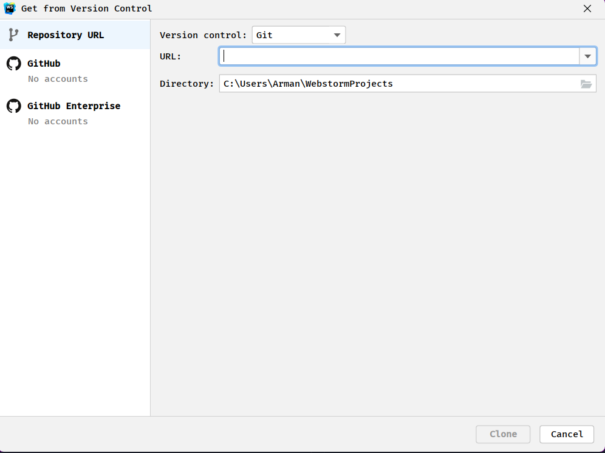

# **Analysis & Development Project - Mars 2052 - client project**

## **Sonar**

Sonar reports: https://sonar.ti.howest.be/dashboard?id=2022.project-ii%3Amars-client-17

## **Table of Contents**
- [**Analysis \& Development Project - Mars 2052 - client project**](#analysis--development-project---mars-2052---client-project)
  - [**Sonar**](#sonar)
  - [**Table of Contents**](#table-of-contents)
  - [**Important public urls**](#important-public-urls)
  - [**Description**](#description)
  - [**Prerequisites**](#prerequisites)
  - [**Setup**](#setup)
  - [**Features**](#features)
  - [**Class taught topics**](#class-taught-topics)
  - [**Self study topics**](#self-study-topics)
  - [**Known Bugs**](#known-bugs)
  - [**Need to know**](#need-to-know)
  - [**Contributors**](#contributors)

## **Important public urls**
* Web project: https://project-ii.ti.howest.be/mars-17/

## **Description**
This is the **client** side project for the **Mars project II**. This will form the frontend for our **Medical** application for MarSolutions. This **README** will contain all info necessary to setup this client locally.

## **Prerequisites**
- You will need an IDE of your choice, however we do recommend you use **Webstorm** as it was the one we used to create this project.
- You will need **GIT** so you can clone our repository.

## **Setup**
1. Either open up **terminal** or your preferred **IDE**(we used **Webstorm**)
2. Create a new directory or project
3. Change into that directory
4. Clone the [client repository](https://git.ti.howest.be/TI/2022-2023/s3/analysis-and-development-project/projects/group-17/client) into that folder \
   `git clone https://git.ti.howest.be/TI/2022-2023/s3/analysis-and-development-project/projects/group-17/client`

   Or use vcs:

5. You have succesfully setup our **client** locally!

## **Features**
- JS
- HTML
- CSS
- SASS
- ChartJS
- Notification/Push API

## **Class taught topics**

- We implemented **Real-time communication** using **Web Sockets**

- We made extensive use of **Graphs** in our client

## **Self study topics**

- We used the **notification API** and **push API**. Whenever you would add a friend or receive an alert, you will receive a notification
- We used **SASS** css compiler extensively .
- We implemented

## **Known Bugs**
- When you want to send messages and you click on a chat with a user, the client triggers a function called 'initChatroom' which opens a socket. Everytime you open a new chat you trigger that function again. That is why you have multiple sockets open. The problem is that the server doesn't know which socket to send the message to. So it sends it to all of them. That is why you get the same message multiple times. The solution is to close the socket when you change the chat but, I don't know how to do that yet.
- The view more buttons sometimes need mulitple clicks to activate

## **Need to know**
- The default user has ID 2 and is being saved in the localstorage. `userId` should be 2, but can be chaned whenever you want to.
- When you want to add a new friend, you need to fill in his name on the friends page, the only problem is that you need to specify his name so that the server can find it inside the database and add it to your friend list. That is why you are only able to add specific users to your friend list. These are example users that you can add to your friend list and test the PushAPI:
  - Ethan Hunt
  - Dominic May
  - Alex Jordan
  - Natalie Mason
  - Molly Henderson
  - Mia Henderson

- Issue with the sonar & validation of HTML:
  - We are using SASS which automatically compiles your SCSS code to CSS. The problem here is that sonar finds many code smells in our CSS code, because of the order of the queryselectors. There is no way to fix this, on our end. The only reason to possibly fix it is by adding a sonar rule to ignore the CSS rule about the order of the queryselectors.

  - Another issue is the validation of the `input[type="time"]` element. This is not supported according to the HTML validator and therefore it fails the validation pipeline. To solve this issue we added an exception in the .vnuignore file so that the validator skips the rule about the input element. We added the rule, because it said that it wasn't supported in all browsers but after research we found out that it is supported in all browsers. \
    Source: [https://developer.mozilla.org/en-US/docs/Web/HTML/Element/input/time](https://developer.mozilla.org/en-US/docs/Web/HTML/Element/input/time)
  - `//NOSONAR` is used to ignore the code smell in the sonar pipeline. This is because for Chart.js you need to create a new 'Chart Object' and you need to pass in the canvas element. This is the only way to create a new chart. Only for this sonar thinks we dont do anything with the canvas element but the library sorts it out for us. This is also applied to the security issue in `sw.js` with the `push eventlistener`.

- to test the sockets in the client, you have to set the `userId` of one of your clients in localstorage so you can see all possible users here:

| User             | UserID |
|------------------|--------|
| Billy Chapman    | 1      |
| Dante Matthews   | 2      |
| David Gill       | 3      |
| Dennis Henderson | 4      |
| Evan Ross        | 5      |
| Lana Stone       | 6      |
| Serena Hawkins   | 7      |
| Isobel Owen      | 8      |
| Lily Hunt        | 9      |
| Mia Henderson    | 10     |
| Molly Henderson  | 11     |
| Natalie Mason    | 12     |
| Alex Jordan      | 13     |
| Dominic May      | 14     |
| Ethan Hunt       | 15     |

- To test out adding friends and push notifications you can add user **11**-**15**

## **Contributors**

- Arman Gasparyan
- Astrid Toschev
- Robin Neyrinck
- Ruben De Bel

---
