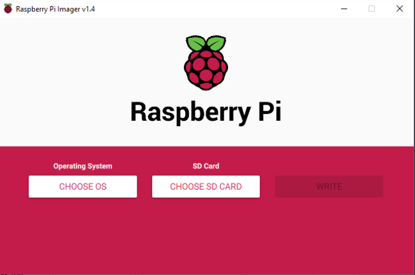
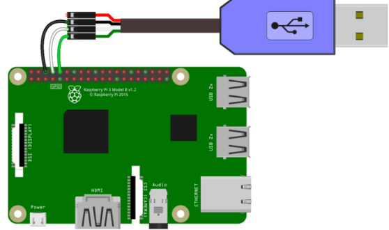
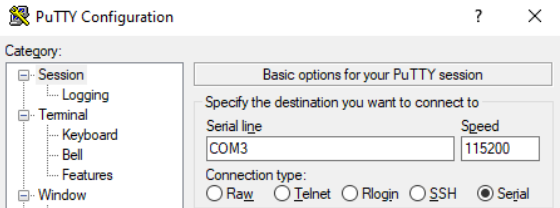
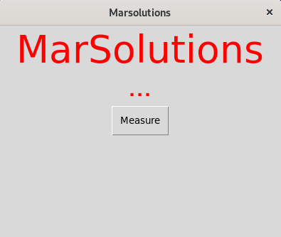

# **Analysis & Development Project - Mars 2052 - iot device project**


## **Table of Contents**
- [**Analysis \& Development Project - Mars 2052 - iot device project**](#analysis--development-project---mars-2052---iot-device-project)
  - [**Table of Contents**](#table-of-contents)
  - [**Description**](#description)
  - [**Prerequisites**](#prerequisites)
  - [**Setup**](#setup)
    - [**Setting up a Raspberry PI**](#setting-up-a-raspberry-pi)
    - [**Application Setup**](#application-setup)
  - [**How to run**](#how-to-run)
  - [**Features**](#features)
  - [**Link to other project repositories**](#link-to-other-project-repositories)
  - [**Contributors**](#contributors)

## **Description**
This is the **iot device** project and repository. In here we can find the files used to create the **heart rate measurer**. In this **README** you can also find a full
setup guide on how to run this application on a brand new **Raspberry PI** and or any other device using a linux distribution.

## **Prerequisites**
To be able to create this application you will need a few things on your host:
- an **MicroSD card** and any adapter to connect it to your computer
- A **Raspberry PI** or any other device with a **linux distro**
- You will need the **Raspberry PI imager**: https://www.raspberrypi.com/software/
- **Putty**: https://www.chiark.greenend.org.uk/~sgtatham/putty/latest.html

## **Setup**

### **Setting up a Raspberry PI**
`You can skip these steps if you decide to work on another linux device`
- Insert you **MicroSD** into your computer

- Open up **Raspberry PI imager**
- **choose OS** and select **ubuntu** 




- follow the setup and **don't** select format SD
- Enable UART on the RPi to add the following line at the bottom of the **config.txt** file in the root of the **boot partition**.
  ```
  enable_uart=1
  ```
- place the **SD** into the **Raspberry PI**
- use the **USB to TLL cable** and connect the wires according to the following scheme:

- open up **device manager** and look for the ports group. in this group you want to remember what COM* you have your Raspberry PI connected to
- now open up **PUTTY** and create the following connection but replace the COM3 with whatever number you'd have:


- Once connected you should be able to boot into your linux machine.
### **Application Setup**
- update your system:
  - `sudo apt update`
  - `sudo apt upgrade`
- we'll need to install a few things:
  - `sudo apt install python3`: so we can use **python**
  - `sudo apt install pip`: so we can install a **gui package**
  - `pip install guizero`: this is the package we've chosen to create our mini application
  - `sudo apt install git`: to clone our repo
  - `cd folder_name`: to change directory to the **folder** you'd wanna use for this application
  - `git clone git@git.ti.howest.be:TI/2022-2023/s3/analysis-and-development-project/projects/group-17/iot.git`

## **How to run**

- To run our newly installed application you need to simply run the following command:
        `python3 heart-rate.py`
- you should see the following screen:



- **Congratulations!** You successfully setup and installed our mini application!
## **Features**
- Display and send a heartrate measurement to our Api which is used by our **medical application**.

## **Link to other project repositories**
- [Server](https://git.ti.howest.be/TI/2022-2023/s3/analysis-and-development-project/projects/group-17/server)
- [Client](https://git.ti.howest.be/TI/2022-2023/s3/analysis-and-development-project/projects/group-17/client)
- [Documentation](https://git.ti.howest.be/TI/2022-2023/s3/analysis-and-development-project/projects/group-17/documentation)

## **Contributors**

- Arman Gasparyan
- Astrid Toschev
- Robin Neyrinck
- Ruben De Bel

---
