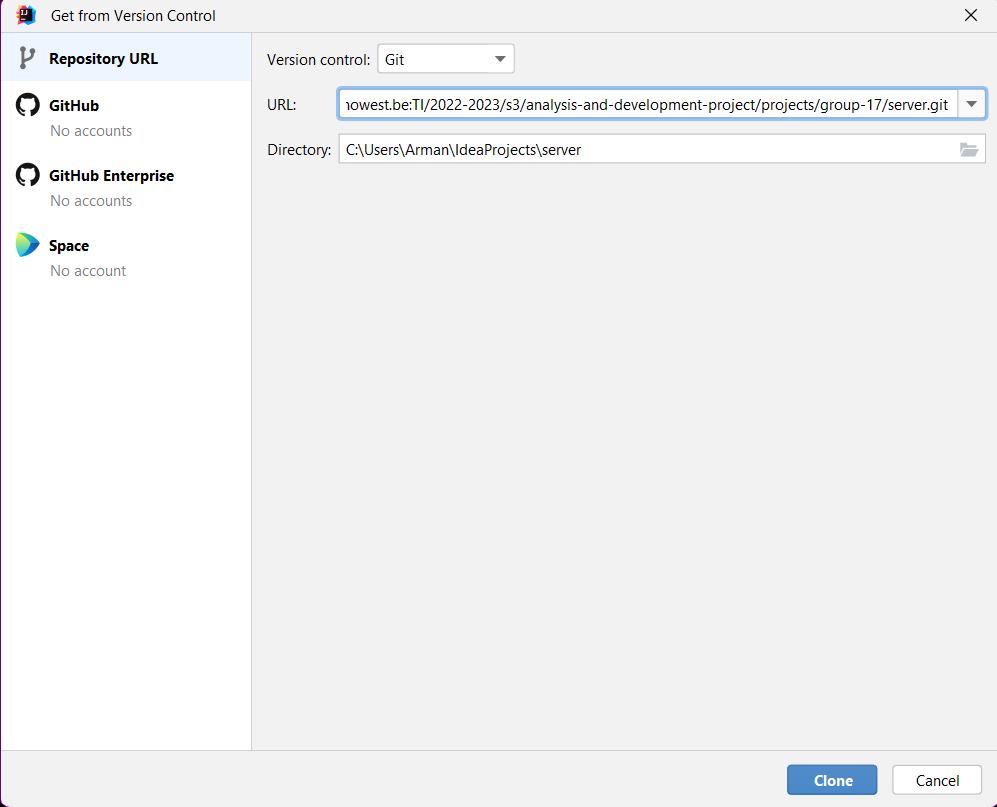
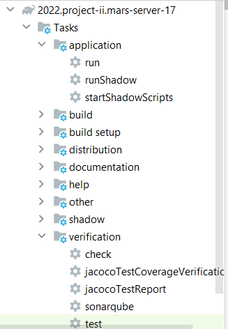

# **Analysis & Development Project - Mars 2052 - server project**

## Sonar

Sonar reports: https://sonar.ti.howest.be/dashboard?id=2022.project-ii%3Amars-server-17

## **Table of Contents**
- [**Analysis \& Development Project - Mars 2052 - server project**](#analysis--development-project---mars-2052---server-project)
  - [**Table of Contents**](#table-of-contents)
  - [**Description**](#description)
  - [**Prerequisites**](#prerequisites)
  - [**Setup**](#setup)
  - [**Features**](#features)
  - [**Endpoints**](#endpoints)
    - [**Users**](#users)
    - [**Friends**](#friends)
    - [**Medical Services**](#medical-services)
    - [**Communication Services**](#communication-services)
  - [**Known bugs**](#known-bugs)
  - [**Contributors**](#contributors)

## **Description**
This is the server side project for the **Mars project II**. In this project you will find a fully fledged **openapi webserver**. This will form the backend for our Medical application for **MarSolutions**. This **README** will contain all info necessary to setup and run this server locally. There is also full documentation available for all the **endpoints** available in the server.

## **Prerequisites**
To be able to set this up locally we will need a few things:
- an **editor**, preferably **Intellij**, as this was used in developing this project.
- **git**, so we can clone the repository.

## **Setup**
- create a **local directory** and open up **Intellij**

- Simply clone the [repository](https://git.ti.howest.be/TI/2022-2023/s3/analysis-and-development-project/projects/group-17/server) in the previously made directory: \
        `git clone https://git.ti.howest.be/TI/2022-2023/s3/analysis-and-development-project/projects/group-17/server` \
or use vcs in **Intellij** to clone the repository: \
        
- to run the server, execute **gradle run** (**Tasks>application>run**) in **Intellij**.
   

- The server should be up and running!

## **Features**
- A h2 database
- Vert.x
- [openapi](https://git.ti.howest.be/TI/2022-2023/s3/analysis-and-development-project/projects/group-17/documentation/-/blob/main/api-spec/openapi-mars.yaml)
- use of higher order functions
- Push api

## **Implemented Endpoints**
*: optional

### **Users**
|Method|URL|Description|
|-|-|-|
|`GET`|/api/users|returns all users from the database|
|`GET`|/api/users/|returns a specific user either based on `name` or `userID`|

### **Friends**
|Method|URL|Description|
|-|-|-|
|`GET`|/api/users/{userID}/friends|returns a specific user's friends by `userID` |
|`GET`|/api/users/{`userID`}/friends/{`friendID`}|returns a specific friend of a user by `userID` and `friendID`|
|`POST`| /api/users/{`userID`}/friends/{`friendID`}| add a new friend to a user by `userID` and `friendID`|
|`REMOVE`| /api/users/{`userID`}/friends/{`friendID`}| remove a friend from a user by `userID` and `friendID`|

### **Medical Services**
|Method|URL|Description|body|
|-|-|-|-|
|`GET`|/api/users/{`userID`}/appointments|return a user's appointments by `userID`|
|`POST`|/api/users/{`userID`}/appointments|create a new appointment for a specific user by `userID`|description, datetime|
|`GET`|/api/users/{`userID`}/medical|return a user's medical info by `userID`|
|`POST`|/api/users/{`userID`}/measure|create a new measurement for a user by `userID`|type, datetime, value, footsteps*, caloriesburnt*, bloodsugarlevel*, bloodpressure*|
|`GET`|/api/users/medical|return all users with medical info|

### **Communication Services**
|Method|URL|Description|body|
|-|-|-|-|
|`GET`|/api/users/{`userID`}/messages/{`friendID`}|return a user's messages between a user and friend by `userID` and `friendID`|
|`POST`|/api/users/{`userID`}/messages/{`friendID`}|send a message from a user to a friend by `userID` and `friendID`| message|
|`GET`|/api/users/{`userID`}/recommendations|return a user's recommendations by `userID`|
|`GET`|/api/users/{`userID`}/alerts|return a user's alerts by `userID`|
|`POST`|/api/users/{`userID`}/alerts|create a new alert for a user by `userID`|name, alerttype, urgency, description|
|`POST`|/api/users/{`userID`}/subscribe|subscribe to the notification service for a specific user by `userID`|keys (auth, p256dh), endpoint|

## **Class taught topics**

- We implemented **Real-time communication** using **Web Sockets**

## **Self study topics**

- We implemented the **push API**. Whenever you would add a friend or receive an alert, you will receive a notification

- We made use of higher order function throughout the server, mostly in Medical Calculator

## **Known bugs**

Currently, no bugs have been found!

## **Contributors**

- Arman Gasparyan
- Astrid Toschev
- Robin Neyrinck
- Ruben De Bel

---
